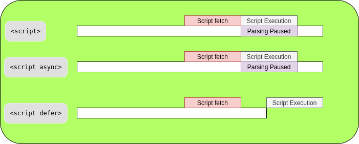

# Pengenalan Javascript


## 1. Permasalahan

Untuk membuat website yang baik, tidak cukup dengan struktur dan tampilan yang bagus, namun juga perlu menjadikan website yang kita buat dapat berinteraksi kepada user. Misalnya dengan memunculkan pesan saat user mengunjungi website tersebut. Website yang interaktif akan jauh lebih menarik bagi para pengunjung website.

## 2. Penjelasan Javascript

Untuk menjadikan website lebih menarik dan interaktif, kita bisa menggunakan javascript. Berbeda dengan HTML yang dapat menentukan struktur web dan CSS untuk menentukan styling dari web, javascript digunakan untuk memberikan berbagai interaksi dengan user, Misalnya :

- Menampilkan pesan apabila tombol ditekan
- Mengubah tampilan apabila tombol ditekan
- Mengolah teks yang dimasukkan user
- Dll

## 3. Detail Penjelasan

### 3.1 Definisi Javascript

**JavaScript** adalah bahasa pemrograman web yang bersifat _Client Side Programming Language_. _Client Side Programming Language_ adalah tipe bahasa pemrograman yang pemrosesannya dilakukan oleh _client_. Aplikasi _client_ yang dimaksud merujuk kepada web browser seperti **Google Chrome** dan **Mozilla Firefox**. Untuk menjalankan JavaScript, kita hanya membutuhkan aplikasi text editor dan web browser.

### 3.2 Penulisan Javascript

### 3.2.1 Embed HTML

Kita dapat langsung menulis script javascript pada file html, caranya dengan menggunakan tag `script`

```html
<!-- index.html -->

<html>
  <head>
    <title>Belajar Javascript</title>
  </head>

  <body>
    <!-- menulis javascript didalam html -->
    <script>
      console.log("hello world");
      document.write(" <h1> Hello World! </h1>");
      document.write("<hr> </hr>");
      document.write("<p> Saya Sedang belajar Javascript </p>");
      document.write("di <b> WRI");
    </script>
  </body>
</html>
```

### 3.2.2 Eksternal Javascript

Kita juga dapat menuliskan file javascript diluar file html, pertama kita harus membuat file javascript kemudian mengimport-nya ke file html

#### 3.2.2.1 Membuat File Javascript

Pertama, buatlah file javascript dengan ekstensi `.js`, misalnya `index.js`

```javascript
// index.js

console.log("hello world");
document.write(" <h1> Hello World! </h1>");
document.write("<hr> </hr>");
document.write("<p> Saya Sedang belajar Javascript </p>");
document.write("di <b> WRI");
```

#### 3.3.2.2 Import File Javascript ke HTML

Kemudian, import file javascript yang sudah dibuat ke html, hal ini dapat dilakukan dengan menggunakan tag `script`, dengan menambahkan attribute `src` yang berisi direktori dan nama file dari file javascript yang akan kita import

```html
<!-- index.html -->

<html>
  <head>
    <title>Belajar Javascript</title>
  </head>

  <body>
    <!-- import file javascript ke html -->
    <script src="index.js"></script>
  </body>
</html>
```

Urutan penulisan tag `script` perlu diperhatikan karena dapat mempengaruhi behaviour dari Javascript. Terdapat 3 macam cara untuk meng-import Javascript ke dalam file HTML kita.

1. **Meletakkan tag `script` di dalam tag `head`**

   Apabila kita meletakkan tag `script` di dalam tag `head`, maka Javascript akan di-execute lebih duluan dibanding HTML. Sehingga apabila kita memiliki kode untuk memanipulasi DOM di dalam Javascript kita, maka akan terjadi error karena browser belum sempat melakukan parsing untuk membentuk DOM Tree dari HTML kita.

   Contoh kasus yang membutuhkan Javascript untuk dieksekusi terlebih dahulu sebelum HTML yaitu menghindari _Flash of Unstyled Content_ atau sering disingkat FOUC. Biasanya hal ini terjadi ketika kita ingin menambahkan light mode dan dark mode pada website kita.

2. **Meletakkan tag `script` di dalam tag `body`**

   Cara kedua merupakan cara yang paling sering dilakukan, karena dengan begini Javascript akan dieksekusi setelah browser membentuk DOM Tree dari HTML kita sehingga kita dapat dengan bebas melakukan manipulasi terhadap DOM.

3. **Meletakkan tag `script` di dalam tag `head` dengan attribute `async`**

   Tag `script` memiliki attribute `async`. Apabila kita menggunakan tag ini, maka script yang kita buat akan di-download secara parallel dengan markup kita. Setelah script berhasil di-download, maka script akan langsung di-eksekusi tanpa menunggu DOM Tree selesai dibangun.

4. **Meletakkan tag `script` di dalam tag `head` dengan attribute `defer`**

   Mirip seperti attribute `async`, script akan di-download secara parallel oleh browser bersamaan dengan markup kita. Namun tidak seperti `async`, script tidak akan langsung ter-eksekusi, namun akan menunggu browser selesai membentuk DOM Tree. Metode ini paling dianjurkan karena script akan di-download secara parallel sehingga performa load website kita akan lebih cepat namun kita masih bebas untuk melakukan manipulasi DOM.

Untuk lebih lengkapnya, kalian bisa melihat grafik dibawah ini



## 4. Contoh Kasus

### 4.1 Membuat File HTML

Pertama, buatlah file HTML baru dengan nama pengenalan-js.html dan isi file tersebut dengan kode program di bawah ini:

```html
<!DOCTYPE html>
<html>
  <head>
    <title>Belajar Javascript</title>
    <link rel="stylesheet" href="style.css" />
  </head>

  <body>
    <script src="index.js"></script>

    <div class="form">
      <h1 class="form_title">Login</h1>
      <input class="form_input" type="text" placeholder="Username" />
      <input class="form_input" type="password" placeholder="Password" />
      <button class="form_submit" id="button" type="submit">submit</button>
    </div>
  </body>
</html>
```

### 4.2 Membuat File CSS

Kedua, buat file CSS dengan nama style.css dan isi file tersebut dengan kode program dibawah ini:

```CSS
* {
    box-sizing: border-box;
    font-family: Arial, Helvetica, sans-serif;
}

body {
    background-color: coral;
    display: flex;
    justify-content: center;

}

.form {
    background-color: white;
    width: 400px;
    padding: 50px;
    border-radius: 5px;
    margin-top: 120px;
}

.form_input {
    display: block;
    padding: 20px 20px;
    margin-bottom: 20px;
    border: solid 5px aquamarine;
    border-radius: 20px;
    outline: none;
    margin-left: 40px
}

.form_submit {
    padding: 10px 20px;
    border: none;
    border-radius: 10px;
    width: 210px;
    background-color: aquamarine;
    color: grey;
    font-weight: bold;
    margin-left: 45px;
    text-align: center;


}

.form_title {
    font-size: 30px;
    font-weight: bold;
    text-align: center;
}
```

### 4.3 Membuat File Javascript

Ketiga, buat file javascript dengan nama index.js dan isi file tersebut dengan kode program di bawah ini:

```javascript
alert("Selamat Belajar Alert di Javascript");

console.log("Semangat Belajar Javascript");
```

### 4.4 Simpan Semua File

Simpan semua file yang sudah dibuat, setelah itu buka file html di web browser. Akan muncul alert atau notifikasi saat kita membuka website yang sudah kita buat sebelumnya.

.jpg>)

untuk melihat kalimat di dalam `console.log`, pada halaman web browser klik kanan > inspect > console.

## 5. Referensi Untuk Mempelajari Javascript

- [**w3school**](https://www.w3schools.com/js/default.asp)
- [**Petanikode**](https://www.petanikode.com/tutorial/javascript/)
- [**freecodecamp**](https://www.freecodecamp.org/challenges/comment-your-javascript-code)
